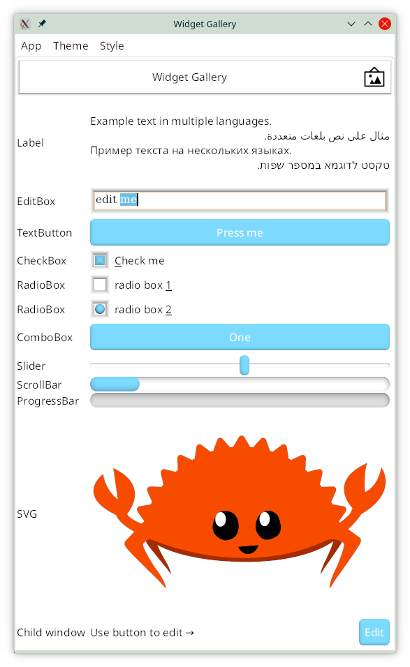

KAS GUI
==========

[](https://github.com/kas-gui/kas/actions)
[](https://github.com/kas-gui/kas-text/)
[](https://docs.rs/kas)


KAS, (historically the *toolKit Abstraction System*), is a general-purpose GUI toolkit.
KAS's design provides:

-   retained mode (library stores state), inspired by Qt (classic)
-   concise, partially declarative specification of widgets
-   type-safe, widget-local event handlers
-   simple ownership with no retained pointers into widget state
-   fast, efficient, responsive UI

## Documentation

-   API docs: <https://docs.rs/kas>, <https://docs.rs/kas-theme>, <https://docs.rs/kas-wgpu>
-   [KAS Tutorials](https://kas-gui.github.io/tutorials/)
-   [Examples](https://github.com/kas-gui/kas/tree/master/kas-wgpu/examples)
-   [Discuss](https://github.com/kas-gui/kas/discussions)
-   [KAS Blog](https://kas-gui.github.io/blog/)

## Examples

Examples can be found in [`kas-wgpu/examples/`](kas-wgpu/examples).
Further examples can be found in [kas-gui/7guis](https://github.com/kas-gui/7guis/).

Precompiled example apps can be downloaded as follows:

-   go to <https://github.com/kas-gui/kas/actions/workflows/build.yml>
-   select the latest (complete) run
-   download one of the `examples-*` artifacts



## Features

The below should give a rough idea of what's done and what's not. See also the
[ROADMAP].

-   Stepless DPI scaling
-   Texts supporting bidirectional languages and font fallback
-   Accelerated graphics via [WebGPU] (via DirectX/Vulkan/Metal or possibly
    OpenGL); currently no CPU fallback
-   Shaders in custom widgets (see [Mandlebrot example](kas-wgpu/examples/README.md#Mandlebrot))
-   Support themes, colour schemes and end-user configuration
-   Keyboard navigation and control
-   View widgets over shared state


Installation and dependencies
----------------

#### Rust

KAS requires [Rust] version 1.52 or greater (currently in **beta**: *usually*
we maintain compatibility with the latest stable release).
Using the **nightly** channel does have a couple of advantages:

-   Proceedural macros emit better diagnostics. In some cases, diagnostics are
    missed without nightly rustc, hence **nightly is recommended for development**.
-   Documentation generated via `cargo doc` requires nightly for links
-   A few minor option things: see [Feature flags](#feature-flags) below.

#### WebGPU

Currently, KAS's only drawing method is [WebGPU] which requires DirectX 11/12,
Vulkan, Metal or OpenGL. Support for OpenGL is limited, currently requiring the
`wgpu/cross` feature flag. For example:
```sh
cd kas-wgpu
KAS_BACKENDS=GL cargo run --example gallery --features wgpu/cross
```

### Quick-start

Install dependencies:
```sh
# For Ubuntu:
sudo apt-get install build-essential git libxcb-shape0-dev libxcb-xfixes0-dev libharfbuzz-dev

# For Fedora:
# glslc is optional; see kas-wgpu/README.md
sudo dnf install libxcb-devel harfbuzz-devel glslc
```

Next, clone the repository and run the examples as follows:
```sh
git clone https://github.com/kas-gui/kas.git
cd kas
cargo test
cd kas-wgpu
cargo build --examples
cargo run --example gallery
cargo run --example layout
cargo run --example mandlebrot
```

To build docs locally:
```
RUSTDOCFLAGS="--cfg doc_cfg" cargo +nightly doc --features markdown --no-deps --all --open
```

### Crates

-   `kas`: the *core* of the GUI library, providing most interfaces and logic
    along with a selection of common widgets
-   `kas-macros`: a helper crate for proc macros (do not use directly)
-   [KAS-text]: font loading, text layout, text navigation
-   `kas-theme`: theming support for KAS (API plus two themes; organisation may change)
-   `kas-wgpu`: provides windowing via [winit] and rendering via [WebGPU]

A user depends on `kas` to write their complete UI specification, selects a
theme from `kas-theme`, instances a `kas_wgpu::Toolkit`, adds the window(s),
and runs the UI.

### Feature flags

The `kas` crate has the following feature flags:

-   `markdown`: enables Markdown parsing for rich-text
-   `config`: adds (de)serialisation support for configuration plus a few
    utility types (specifying `serde` instead only implements for utility types)
-   `json`: adds config (de)serialisation using JSON (implies `config`)
-   `yaml`: adds config (de)serialisation using YAML (implies `config`)
-   `ron`: adds config (de)serialisation using RON (implies `config`)
-   `svg`: adds support for SVG images
-   `winit`: adds compatibility code for winit's event and geometry types.
    This is currently the only functional windowing/event library.
-   `stack_dst`: some compatibility impls (see `kas-theme`'s documentation)
-   `internal_doc`: turns on some extra documentation intended for internal
    usage but not for end users. (This only affects generated documentation.)

### Configuration

Formats are not yet stabilised, hence reading/writing configuration is disabled
by default. Ensure that the `yaml` and/or `json` feature flag is enabled, then
configure with environment variables:
```sh
# Set the config path:
export KAS_CONFIG=kas-config.yaml
# Use write-mode to write out default config:
KAS_CONFIG_MODE=writedefault cargo run --example gallery
# Now just edit the config and run like normal:
cargo run --example gallery
```

[KAS-text]: https://github.com/kas-gui/kas-text/
[winit]: https://github.com/rust-windowing/winit/
[HarfBuzz]: https://harfbuzz.github.io/
[WebGPU]: https://github.com/gfx-rs/wgpu-rs
[ROADMAP]: ROADMAP.md


Copyright and Licence
-------

The [COPYRIGHT](COPYRIGHT) file includes a list of contributors who claim
copyright on this project. This list may be incomplete; new contributors may
optionally add themselves to this list.

The KAS library is published under the terms of the Apache License, Version 2.0.
You may obtain a copy of this licence from the [LICENSE](LICENSE) file or on
the following webpage: <https://www.apache.org/licenses/LICENSE-2.0>
