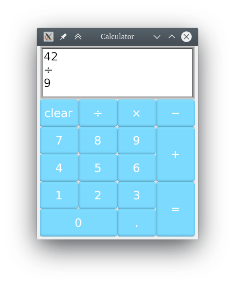
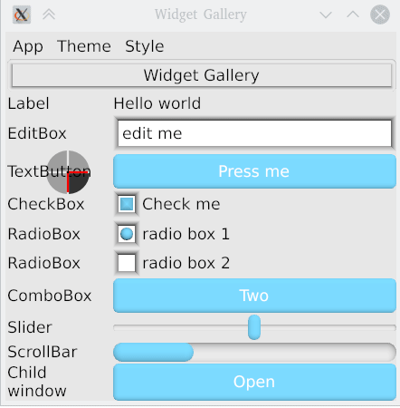
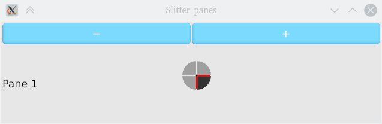
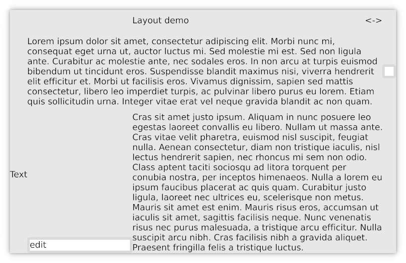
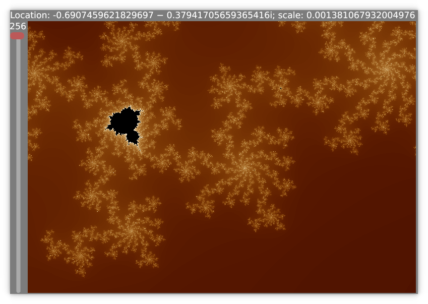

KAS GUI
==========

[](https://github.com/kas-gui/kas/actions)
[](https://github.com/kas-gui/kas-text/)
[](https://docs.rs/kas)


KAS, the *toolKit Abstraction System*, is a general-purpose GUI toolkit.
KAS's design provides:

-   retained mode (library stores state), inspired by Qt (classic)
-   concise, partially declarative specification of widgets
-   type-safe, widget-local event handlers
-   simple ownership with no retained pointers into widget state
-   widgets embed state and handlers (easy reuse of complex components)
-   scalability to millions of widgets (WIP)

## Examples

For details, see the [Examples README](kas-wgpu/examples/README.md).

 




## Features

-   Touchscreen input, mouse input, full keyboard navigation, accelerator keys
-   Bidirectional text support and complex glyph shaping via [HarfBuzz]
-   Scalable (HiDPI) supporting fractional scaling
-   Themes (sizing and rendering control) and colour schemes
-   Embedded graphics via custom [WebGPU] graphics pipes
-   Widget layout via grids (with spans), rows and columns
-   Idempotent widget resizing

### Missing features

These aren't here yet!

-   Raster graphics
-   Flow-box layouts
-   Rich text formatting
-   CPU and OpenGL rendering (currently only supports drawing via [WebGPU],
    which should support most modern systems but not all)
-   User-configuration and desktop integration
-   And much more, see the [ROADMAP].

## Widgets

Below are some highlights. Find the full list in the [docs](docs.rs/kas/*/kas/widget).

-   Single- and multi-line text editing via `EditBox`
-   `ScrollRegion` with `ScrollBar`s
-   Resizable `List` and `Splitter` with drag handles
-   `MenuBar` featuring all expected input methods
-   `RadioBox` with broadcast communication via a group identifier
-   A simple `MessageBox` dialog


Installation and dependencies
----------------

#### Rust

KAS requires [Rust] version 1.45 or greater. All examples are compatible with
the **stable** channel, but using the **nightly** channel does have a couple of
advantages:

-   Proceedural macros emit better diagnostics. In some cases, diagnostics are
    missed without nightly rustc, hence **nightly is recommended for development**.
-   Documentation generated via `cargo doc` requires nightly for links
-   A few minor option things: see [Feature flags](#feature-flags) below.

#### WebGPU

Currently, KAS's only drawing method is [WebGPU] which requires DirectX 11/12,
Vulkan or Metal.
In the future, there may be support for OpenGL and software rendering.

#### HarfBuzz (optional)

This is only needed if the `shaping` feature is enabled. On my system, the
following libraries are used: `libharfbuzz.so.0`, `libglib-2.0.so.0`,
`libgraphite2.so.3` and `libpcre.so.1`.

### Quick-start

Install dependencies:

```sh
# For Ubuntu:
sudo apt-get install build-essential git libxcb-shape0-dev libxcb-xfixes0-dev libharfbuzz-dev

# For Fedora:
# glslc is optional; see kas-wgpu/README.md
sudo dnf install libxcb-devel harfbuzz-devel glslc
```

Next, clone the repository and run the examples as follows:

```
git clone https://github.com/kas-gui/kas.git
cd kas
cargo test
cd kas-wgpu
cargo build --examples
cargo run --example gallery
cargo run --example layout
cargo run --example mandlebrot
```

### Crates

-   `kas`: the *core* of the GUI library, providing most interfaces and logic
    along with a selection of common widgets
-   `kas-macros`: a helper crate for proc macros (do not use directly)
-   [`kas-text`]: font loading, text layout, text navigation
-   `kas-theme`: theming support for KAS (API plus two themes; organisation may change)
-   `kas-wgpu`: provides windowing via [`winit`] and rendering via [WebGPU]
-   `kas-widgets`: (unrealised) - providing extra widgets

A user depends on `kas` to write their complete UI specification, selects a
theme from `kas-theme`, instances a `kas_wgpu::Toolkit`, adds the window(s),
and runs the UI.

### Feature flags

The `kas` crate has the following feature flags:

-   `shaping`: enables complex glyph forming for languages such as Arabic.
    This requires that the HarfBuzz library is installed.
-   `internal_doc`: turns on some extra documentation intended for internal
    usage but not for end users. (This only affects generated documentation.)
-   `winit`: adds compatibility code for winit's event and geometry types.
    This is currently the only functional windowing/event library.
-   `stack_dst`: some compatibility impls (see `kas-theme`'s documentation)


[`kas-text`]: https://github.com/kas-gui/kas-text/
[`winit`]: https://github.com/rust-windowing/winit/
[HarfBuzz]: https://harfbuzz.github.io/
[WebGPU]: https://github.com/gfx-rs/wgpu-rs
[ROADMAP]: ROADMAP.md


Copyright and Licence
-------

The [COPYRIGHT](COPYRIGHT) file includes a list of contributors who claim
copyright on this project. This list may be incomplete; new contributors may
optionally add themselves to this list.

The KAS library is published under the terms of the Apache License, Version 2.0.
You may obtain a copy of this licence from the [LICENSE](LICENSE) file or on
the following webpage: <https://www.apache.org/licenses/LICENSE-2.0>
