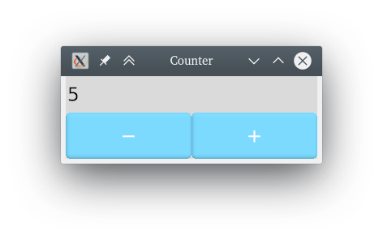
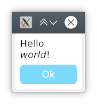
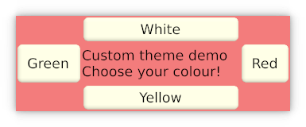

KAS Examples
==========

Exmaples demonstrate various features of KAS.

Note that screenshots may be outdated since themes, draw routines and layout code has been updated quite frequently.

### Gallery

A testbed demoing most widgets along with theme and colour switching.

### Counter

(Almost) the simplest interactive example possible: a counter with push-buttons.

**Variant:** `sync-counter` opens two windows with a synchronised counter.

### Calculator

A simple calculator, with (limited) keyboard support.

### Clock

A simple clock. An example of a custom widget using lower-level draw routines.

### Splitter

Demonstrates resizable panes.

### Hello

A message box.

### Stopwatch

Ready? Set! Go!

### Dynamic

An example with dynamic contents. Doubles as a performance tester for how many
widgets are viable in a window (beyond around 10'000, init/resizing is slow but
interaction is still fast).

### Layout

Demonstration of complex layout setting. Resizing is a little slow due to the
text layout engine (may be improved in the future).

### Custom theme

An example demonstrating a custom theme implementation.
Pretty useless, but hey, funky background colours!

### Mandlebrot

An example demonstrating a custom draw pipe.

Copyright and Licence
-------

The <COPYRIGHT> file includes a list of contributors who claim copyright on this
project. This list may be incomplete; new contributors may optionally add
themselves to this list.

The KAS library is published under the terms of the Apache License, Version 2.0.
You may obtain a copy of this licence from the <LICENSE-APACHE> file or on
the following webpage: <https://www.apache.org/licenses/LICENSE-2.0>
